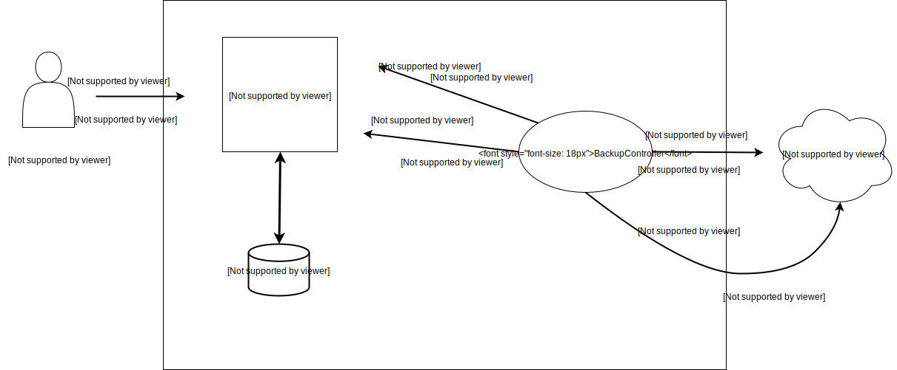

**[WIP]**

* [Overview](#Overview)
* [Backup in Kubernetes](#backup-tools)
  * [Ark](#1ark)
    * [Ark Architecture](#11-ark-architecture)
      * [Ark Backup Workflow](#111-ark-backup-workflow)
      * [Ark Scheduled Backups](#112-ark-scheduled-backups)
      * [Ark Restores](#113-ark-backup-restores)
      * [Ark-Sync](#114-ark-sync)
    * [Ark Installation](#12-ark-installation)
      * [Ark Client](#121-ark-client-installation)
      * [Ark Server](#122-ark-server-installation)
    * [Ark AWS Setup](#12-ark-installation)
      * [Ark AWS Configuration](#131-ark-aws-configuration)
      * [Ark AWS Backup](#132-ark-aws-backup)
      * [Ark AWS Restore](#133-ark-aws-restore)
    * [Ark GCP Setup](#12-ark-installation)
      * [Ark GCP Configuration](#141-ark-gcp-configuration)
      * [Ark GCP Backup](#142-ark-gcp-backup)
      * [Ark GCP Restore](#143-ark-gcp-restore)
    * [Ark Azure Setup](#12-ark-installation)
      * [Ark Azure Configuration](#151-ark-azure-configuration)
      * [Ark Azure Backup](#152-ark-azure-backup)
      * [Ark Azure Restore](#153-ark-azure-restore)
  * [etcd](#2-etcd)

**The art of knowing is, knowing what to ignore.**

# Overview

When you are in a managed environments such as GKE, EKS, OpenShift etc, you don't have issues around restoring cluster state or upgrading to new Kubernetes version. 

But when you’re operating the cluster yourself, biggest challenge comes to Kube-Admins is how to take a backup and then restore without downtimes from backups.

Moreover, when you  are using Kubernetes in a production setup, you would like to take a backup and restore your entire Kubernetes cluster (automatically) with a single action.

There can be numerous other reasons where taking a backup and then restore from it becomes important from business point of view for an organization.

Below are the main reasons to take backup/restore 

* To recover from disasters
* To test upgrades
* To replicate clusters
* To migrate clusters

We can take Kubernetes DB backup which is etcd or we can take Kubernetes Cluster resources backup in the form of YAML files.

# Backup-tools

There are many tools in market and few of them are listed below.

Usage of the tool(s) changes as the strategy of taking backup changes. The setup will be different depending on  underlying cloud provider such as AWS, GCP, Azure etc. We will cover 3 main Cloud providers setup of Ark tool.


## 1.Ark

Ark is a tool from Heptio and is a utility for managing disaster recovery of your Kubernetes Clusters, specifically  cluster resources and persistent volumes. It configures with underlying cloud provider easily and can also  take snapshots of persistent volumes. If you have stateful applications, Ark should be in the list to take backups. 

Ark can back up or restore all objects in the cluster, and can also filter objects by type, namespace, and/or label. Ark is ideal for the disaster recovery use case, as well as for snapshotting application state, before performing system operations on your cluster (e.g. upgrades).

Ark have below capabilites:

* Can take backups of underlying cluster and restore from backup in case of loss.
* Can copy current cluster resources to other clusters.
* Can replicate your production environment for development and testing environments.

Ark have typical client-server setup and have 2 components:

* A server containing Customr-Rsource-Definitions(CRD's) that runs on the server.
* A command-line client that runs locally.

Ark can run in clusters on a cloud or on-prem clusters. It supports many storage providers for backups and snapshot operations. After adding a plugin system in version 0.6.0, users can create their own plugins to add further complexity and logic in order to be compatible with additional backups and volume storage platforms without modifying the Ark codebase.

Below are the Storage Providers supported by Ark officially.

| Provider                  | Owner    | 
|---------------------------|----------|
| AWS S3                    | Ark      |
| Azure Blob Storage        | Ark      |
| Google Cloud Storage      | Ark      |

Below is the list of Ark Snapshot providers

| Provider                         | Owner           |
|----------------------------------|-----------------|
| AWS EBS                          | Ark             |
| Azure Managed Disks              | Ark             |
| Google Compute Engine Disks      | Ark             |
| Restic                           | Ark             |
| [Portworx][1]                    | Portworx        |
| [DigitalOcean][2]                | StackPointCloud |


### 1.1 Ark Architecture

Ark tool consists of custom-resources like backup,restore, schedules and defined in Kubernetes as Custom-Resource-Definitions(CRD) and then stored in etcd.

Some of the CRD's are 

1. Config
2. Backup
3. Restore
4. Schedule

Config CRD provides core information and options such for cloud provider settings.
Schedule CRD allows to back up data at recurring intervals.
Backup CRD allows to take backup with help of BackupController.
Restore CRD allows to restore all of the objects and persistent volumes from a previously created backup.

During a backup operation:

1. Ark created a tarball of all resources and uploads the Kubernetes objects into cloud object storage.
2. Ark calls the cloud provider API to make disk snapshots of persistent volumes, if specified.

Hooks can also be executed during the backup process. Hooks can work pre and post backups and can do certain tasks before and after taking backups. For example, we might need to tell database to flush in-memory buffers of disk before taking a snapshot. We will take one example of hooks below.

Point to note here is that Ark backups are not strictly atomic. In cases where Kubernetes objects are being created or edited at the time of backup, those objects/resources might not be included in the backup. Though such odds are pretty low, but quite possible in very active clusters.

#### 1.1.1 Ark Backup Workflow

Architecture is shown below. Backup Contoller is created while creating the Ark Server side component using CRDs. We will see this part in the installation section.

<p align="center">
   </image>
</p>

Flow of events during backup process:

1. Ark client sends a call to the Kubernetes API server to create a Backup object.
2. Ark Server component BackupController notices creation of new Backup object and performs validation.
3. BackupController begins backup process and collects the data to backup by querying the API server for resources.
4. BackupController makes a call to the object storage service – e.g, AWS S3 – to upload the backup file.

By default, ark backup create makes disk snapshots of any persistent volumes. You can adjust the snapshots by specifying additional flags. See the CLI help for more information. Snapshots can be disabled with the option --snapshot-volumes=false.

#### 1.1.2 Ark Scheduled Backups

We can scedule a backup using a cron and backup can be created at a specified time. Scheduled backups are saved with the name <SCHEDULE NAME>-<TIMESTAMP>, where <TIMESTAMP> is formatted as YYYYMMDDhhmmss.

During creation of backup, we can specify a TTL by adding the flag --ttl <DURATION>. If Ark sees that an existing backup resource is expired, it removes:

1. The backup resource
2. The backup file from cloud object storage
3. All PersistentVolume snapshots
4. All associated Restores

#### 1.1.3 Ark Backup Restores

Restore operation will restore all objects and persistent volumes from a previously created backup. We can also restore only a filtered subset of objects and persistent volumes.

The default name of a restore is <BACKUP NAME>-<TIMESTAMP>, where <TIMESTAMP> is formatted as YYYYMMDDhhmmss. Custom name can also be given to backups. A restored object also includes a label with key ark-restore and value <RESTORE NAME>.

Ark can also be run in restore-only mode, which then disables backup, schedule, and garbage collection functionalities during disaster recovery.

#### 1.1.4 Ark Sync

Ark treats target object storage as the source of truth. It checks continuouslyif the correct backup resources are always present. If there is a properly formatted backup file in the storage bucket, but no corresponding backup resource in the Kubernetes API, Ark synchronizes the information from object storage to Kubernetes.

This allows restore functionality to work in a cluster migration scenario, where the original backup objects do not exist in the new cluster.

### 1.2 Ark Installation

Ark works in client-server approach and it can run in Cloud or on-prem both. Compatible Storage providers are listed above.

#### 1.2.1 Ark-Client Installation

This is the easiest part.

Install the [Ark-Client](https://github.com/heptio/ark/releases) directly as pre-compiled library as per the environment.
And put the client in your PATH environment variable.

You can run the `ark` command to check the client version.

```
[ark@k8s] $ which ark
/usr/local/bin/ark
[ark@k8s] $
[ark@k8s] $ ark version
Version: v0.9.6
Git commit: v0.9.6
Git tree state: clean
[ark@k8s] $ 
```

If you are able to run above command, you have successfully installed the ark client.

#### 1.2.2 Ark-Server Installation

Ark server side installation comprised of CRD's which are present at  [ark-github-repo] (https://github.com/heptio/ark/tree/master/examples/common)

By default, CRD's will be created in namespace **heptio-ark**. But namespace is configurable. Alongwith CRDs, a namespace, service-account and ClusterRoleBinding resources will also be created.

There is support for [restic][3] configurations also from ark version 0.9.0.

Change the namespace name, ClusterRoleBindings configuration or Service Acccount details for custom installation. Default installation is straight forward. Below is an example for default installation.

```
[ark@k8s] $ kubectl apply -f https://raw.githubusercontent.com/heptio/ark/master/examples/common/00-prereqs.yaml
[ark@k8s] $ kubectl apply -f 00-prereqs.yaml
customresourcedefinition.apiextensions.k8s.io "backups.ark.heptio.com" created
customresourcedefinition.apiextensions.k8s.io "schedules.ark.heptio.com" created
customresourcedefinition.apiextensions.k8s.io "restores.ark.heptio.com" created
customresourcedefinition.apiextensions.k8s.io "configs.ark.heptio.com" created
customresourcedefinition.apiextensions.k8s.io "downloadrequests.ark.heptio.com" created
customresourcedefinition.apiextensions.k8s.io "deletebackuprequests.ark.heptio.com" created
customresourcedefinition.apiextensions.k8s.io "podvolumebackups.ark.heptio.com" created
customresourcedefinition.apiextensions.k8s.io "podvolumerestores.ark.heptio.com" created
customresourcedefinition.apiextensions.k8s.io "resticrepositories.ark.heptio.com" created
customresourcedefinition.apiextensions.k8s.io "backupstoragelocations.ark.heptio.com" created
namespace "heptio-ark" created
serviceaccount "ark" created
clusterrolebinding.rbac.authorization.k8s.io "ark" created
```

As the Ark CRD's are created as above. You can check the CRD resources created using below command.

```
[ark@k8s] $ kubectl get crd -o go-template='{{range .items}}{{if eq .spec.group "ark.heptio.com"}}{{.metadata.name}}{{"\n"}}{{end}}{{end}}'
backups.ark.heptio.com
backupstoragelocations.ark.heptio.com
configs.ark.heptio.com
deletebackuprequests.ark.heptio.com
downloadrequests.ark.heptio.com
podvolumebackups.ark.heptio.com
podvolumerestores.ark.heptio.com
resticrepositories.ark.heptio.com
restores.ark.heptio.com
schedules.ark.heptio.com
```

If you see all the resources above, Ark server side coponent is installed properly.

With both Ark client and server components installed, let's setup the storage in different cloud vendors to store the backups. We will conver AWS in next section. 

### 1.3 Ark AWS Setup

To do the setup for Ark in AWS, we need to do the follwing steps. 

1. Create S3 Bucket in chosen resion.
2. Create AWS IAM user/role/policies for Ark.
3. Configure Ark CRD resource name Config with details from point 1 and 2.
4. Create Kubernetes Secrete resource for user credentials or configure [Kube2iam][4]

Note: The best practices to keep secrets in Kubernetes can be seen in Security Chapter. We highly recommend to read that chapter and use the tricks here in the examples below.

#### 1.3.1 Ark AWS Configuration

Lets perform the above 4 tasks.

##### 1.3.1.1 Create AWS S3 Bucket

Ark needs a storage to store the backups. S3 is object based storage in AWS and best choice to store backups for Kubernetes cluster resources.

```
[ark@k8s] $ aws s3api create-bucket --bucket heptio-ark-kubernetes-demo --region us-east-1
{
    "Location": "/heptio-ark-kubernetes-demo"
}
[ark@k8s] $ 
[ark@k8s] $ aws s3 ls
2018-10-22 23:53:06 heptio-ark-kubernetes-demo
2018-06-12 15:06:41 elasticbeanstalk-eu-west-2-136335740207
018-10-11 21:13:08 spinnakerforpractice-us-east-1
[ark@k8s] $ 
[ark@k8s] $ aws s3 ls s3://heptio-ark-kubernetes-demo
[ark@k8s] $ 
```

##### 1.3.1.2 Create AWS IAM User

This step is divided in 4 parts and we will perform them one by one.


#### 1.3.2 Ark AWS Backup

#### 1.3.3 Ark AWS Restore

### 1.4 Ark GCP Setup

#### 1.4.1 Ark GCP Configuration

#### 1.4.2 Ark GCP Backup

#### 1.4.3 Ark GCP Restore

### 1.5 Ark Azure Setup

#### 1.5.1 Ark Azure Configuration

#### 1.5.2 Ark Azure Backup

#### 1.5.3 Ark Azure Restore

*Pre-requisites*

For storing data in AWS S3 bucket.

1. Create S3 bucket in specific region
2. Create S3 user for bucket that user should have S3 bucket full permission.
3. Create Access key & secret key for that user.
4. Change value of **Access_key** and **Secret_key** in file `00.secret.yaml` in aws.
5. Change bucket name & aws region in file `00-ark-config.yaml`.
6. Change AWS account number & username as your aws account no. and  username in file `02.deployment-kube2iam.yaml`.

**Commands**

```
[slamba ◯  WHM0005395  01.Deployment ] ☘   kubectl apply -f crd/01.ark_pre_requisites.yaml
[slamba ◯  WHM0005395  01.Deployment ] ☘   kubectl apply -f aws/.
[slamba ◯  WHM0005395  01.Deployment ] ☘   kubectl apply -f kubernetes-resources/nginx_deployment.yaml
[slamba ◯  WHM0005395  01.Deployment ] ☘   ark backup create nginx-backup --selector app=nginx
[slamba ◯  WHM0005395  01.Deployment ] ☘   kubectl delete -f kubernetes-resources/nginx_deployment.yaml
[slamba ◯  WHM0005395  01.Deployment ] ☘   ark restore create nginx-backup --from-backup nginx-backup

```

### 1.3 Ark - How to restore from a backup

## 2. etcd


[1]: https://docs.portworx.com/scheduler/kubernetes/ark.html
[2]: https://github.com/StackPointCloud/ark-plugin-digitalocean
[3]: https://restic.net/
[4]: https://github.com/jtblin/kube2iam